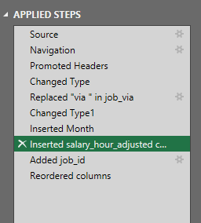
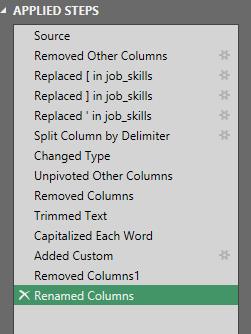
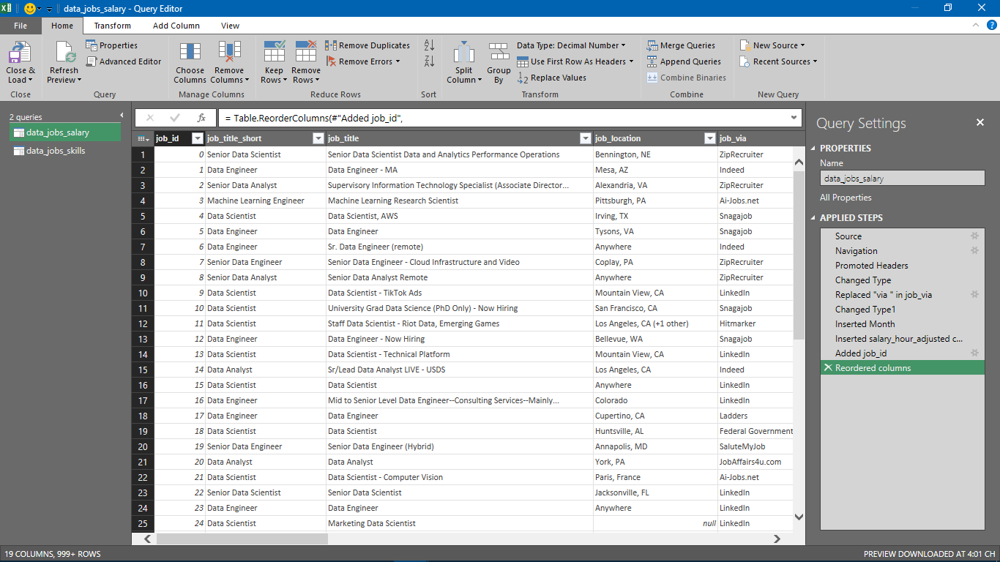
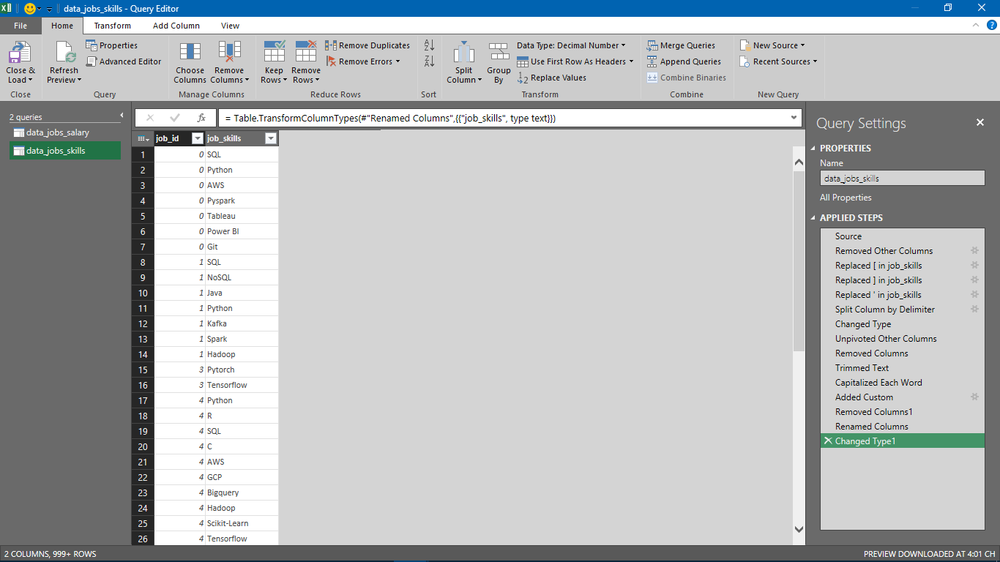
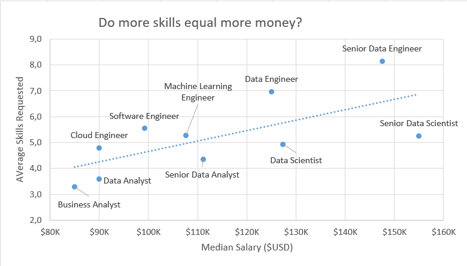
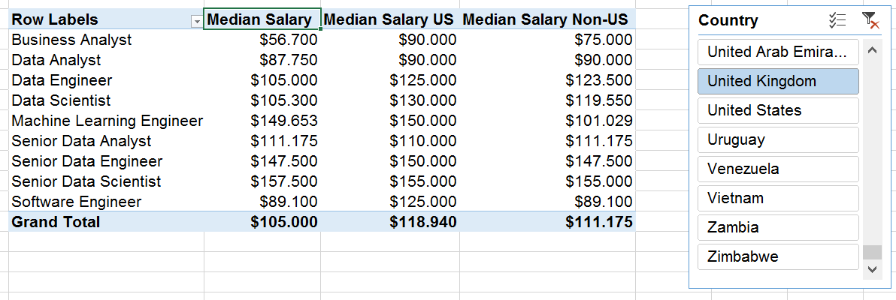
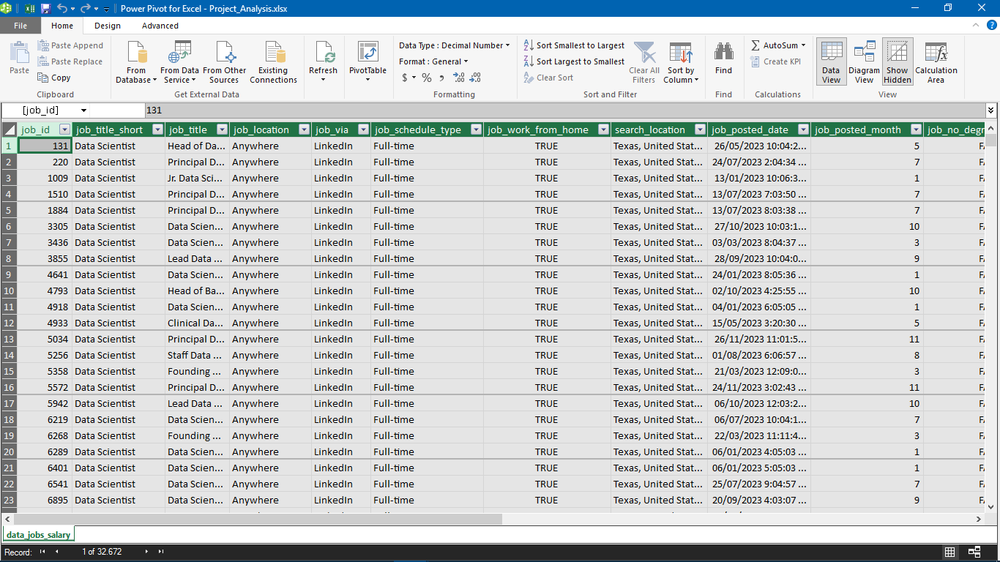
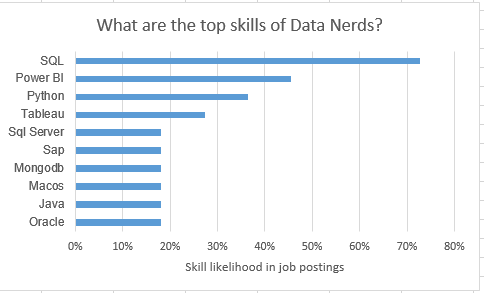
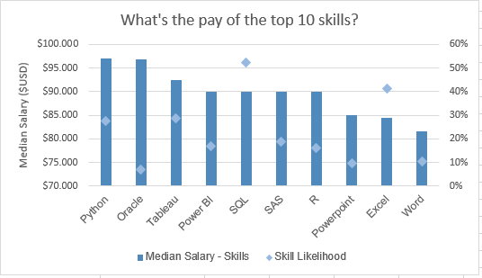

# Project 2 Analysis
## Introduction
This project aims to explore and understand the skills most frequently requested by top employers in today's job market. Using Excel for data cleaning, visualization, and analysis.
By uncovering these trends, this project can help job seekers make informed decisions about which skills to develop in order to boost their employability and earning potential.
## Questions to Analyze

To understand the data science job market, this project explores the following questions:

- **Do more skills get you better pay?**  
- **What’s the salary for data jobs in different regions?**  
- **What are the top skills of data professionals?**  
- **What’s the pay for the top 10 skills?**  
##  Excel Skills Used

The following Excel skills were utilized for analysis:

- 📊 **Pivot Tables**
- 📈 **Pivot Charts**
- 🔖 **DAX (Data Analysis Expressions)**
- 🔍 **Power Query**
- 💪 **Power Pivot**

## Data Jobs Dataset

The dataset used for this project contains real-world data science job information from 2023. The dataset is available via an Excel course, which provides a foundation for analyzing data using Excel.

It includes detailed information on:

- 👨 **Job titles**  
- 💰 **Salaries**  
- 📍 **Locations**  
- 🛠️ **Skills**
## 1. Do More Skills Get You Better Pay?

### 🔍 **Skill Spotlight: Power Query (ETL Process)**

### 📥 Extract  
I used Power Query to import the original dataset (`data_salary_all.xlsx`) and created two separate queries:
- 🗃️ One containing all data job listings and relevant details.  
- 🔧 Another breaking down the individual skills associated with each job ID.

### 🔄 Transform  
Each query was refined by:
- Adjusting column data types  
- Removing unnecessary fields  
- Cleaning up text (e.g., removing specific keywords)  
- Trimming extra spaces for consistency and accuracy
 - #### 📊 `data_jobs_all`
This query contains all job-related information, including job titles, salaries, locations, and more.




---

 - #### 🛠️ `data_job_skills`
This query focuses on the extracted skills for each job ID, allowing for detailed skill-based analysis.



### 🔗 Load

After transforming the data, I loaded both queries into the Excel workbook to prepare for in-depth analysis.

#### 📊 `data_jobs_all`  




---

#### 🛠️ `data_job_skills`  


## 📊 Analysis

### 💡 Key Insights

- 📈 There is a clear upward trend showing that jobs requiring a greater number of skills often offer higher median salaries. This pattern is especially noticeable in positions such as **Senior Data Engineer** and **Data Scientist**.

- 💼 In contrast, roles with fewer skill requirements—such as **Business Analyst**—typically come with lower salary ranges. This suggests that possessing a broader or more specialized skill set significantly enhances earning potential in the data field.



### 📌 So What?

This trend emphasizes the value of acquiring multiple relevant skills, particularly for individuals aiming for higher-paying roles.

## 2️⃣ What’s the Salary for Data Jobs in Different Regions?

### 🧮 Skills Used

- PivotTables  
- DAX  

---

### 📈 Pivot Table Setup

I created a PivotTable using the **Data Model** built with **Power Pivot**:

- **Rows Area**: `job_title_short`  
- **Values Area**: `salary_year_avg`  

To focus on U.S.-based roles, I added a measure to calculate the **median salary** for jobs in the United States:

```dax
=CALCULATE(
    MEDIAN(data_jobs_all[salary_year_avg]),
    data_jobs_all[job_country] = "United States"
)
```
### 🧮 DAX

To calculate the median yearly salary, I used the following DAX measure:

```dax
Median Salary := MEDIAN(data_jobs_all[salary_year_avg])
```
### 📊 Analysis

#### 💡 Insights

💼 The analysis shows that job roles such as **Senior Data Engineer** and **Data Scientist** consistently have **higher median salaries** both in the US and internationally. This indicates a strong global demand for professionals with advanced data expertise.

💰 There is also a noticeable **salary difference between US-based and non-US-based roles**, particularly in high-tech positions. This disparity may be influenced by the concentration of major technology companies and data-driven industries within the United States.


### 📌 So What?

> 💡 These salary insights are important for planning and salary negotiations, helping professionals and companies align their offers with market standards while considering geographical variations.

## 3️⃣ What Are the Top Skills of Data Professionals?

### 🔧 Skill: Power Pivot

#### 💪 Power Pivot in Action

-  I created a **Data Model** by integrating the `data_jobs_all` and `data_jobs_skills` tables into one model.
-  Since I had already cleaned the data using **Power Query**, Power Pivot automatically established a **relationship** between the two tables.
-  I created this relationship using the **`job_id`** column as the key.

### 🖼️ Data Model Diagram


### 🧩 Power Pivot Menu

The **Power Pivot** menu was used to refine my data model and made it easy to create custom measures.

### 🖼️ Power Pivot Interface




### 📊 Analysis

#### 💡 Insights

- 💻 **SQL** and **Python** dominate as top skills in data-related jobs, reflecting their foundational role in data processing and analysis.
- ☁️ Emerging technologies like **AWS** and **Azure** also show significant presence, underlining the industry's shift towards cloud services and big data technologies.


### 📌 So What?
- Understanding prevalent skills in the industry not only helps professionals stay competitive but also guides training and educational programs to focus on the most impactful technologies.
## 4️⃣ What’s the Pay of the Top 10 Skills?

### 📊 Skill: Advanced Charts (PivotChart)

#### 📈 PivotChart Setup

I created a **combo PivotChart** to visualize both **median salary** and **skill likelihood (%)** using data from my PivotTable:

- 🪙 **Primary Axis**: Median Salary (as a Clustered Column)
- 👍 **Secondary Axis**: Skill Likelihood (as a Line with Markers)

To improve clarity and design:
- I added chart and axis titles  
- Removed the lines from the skill likelihood  
- Changed the line markers to **diamond shapes**

### 📊 Analysis

#### 💡 Insights

- 💰 **Higher median salaries** are associated with skills like **Python**, **Oracle**, and **SQL**, suggesting their critical role in high-paying tech jobs.

- 📉 Skills like **PowerPoint** and **Word** show the **lowest median salaries and likelihood**, indicating lower specialization and demand in high-salary sectors.


### 📌 So What?

- This chart highlights the importance of investing time in learning high-value skills like Python and SQL, which are evidently tied to higher paying roles, especially for those looking to maximize their salary in the tech industry.
## 🎯 Conclusion
As a data enthusiast starting my journey, I created this Excel project to explore the data job market using real-world job posting data from a data analyst course. I analyzed job titles, salaries, locations, and in-demand skills using tools like Power Query, PivotTables, DAX, and PivotCharts.

One key insight was the strong connection between technical skills (like Python, SQL, and cloud platforms) and higher salaries. This project helped me build a solid foundation in data analysis and better understand what employers look for in data roles. I hope it also serves as a useful reference for other beginners like me who are learning and preparing to step into the world of data.
